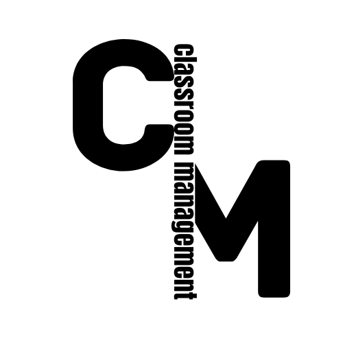
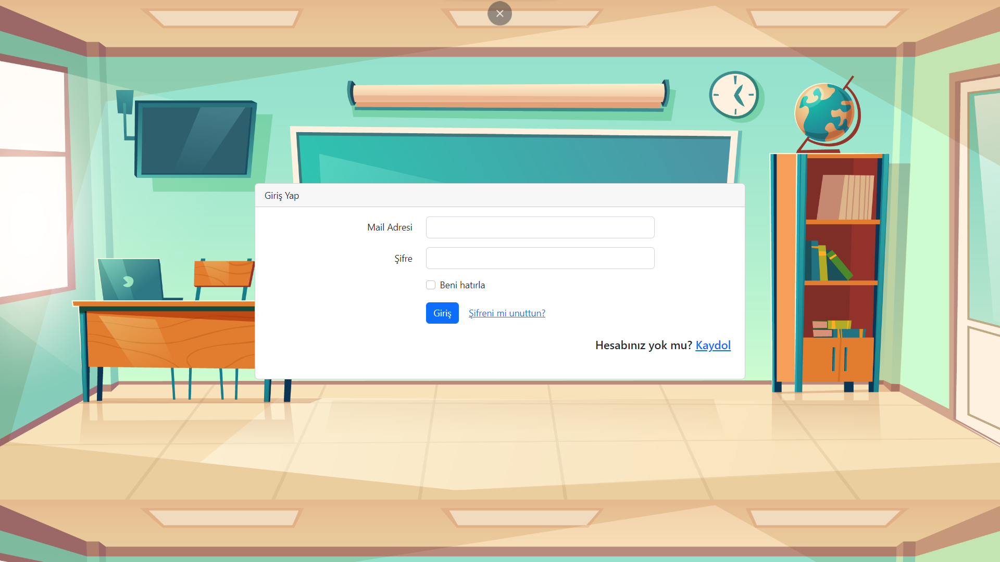
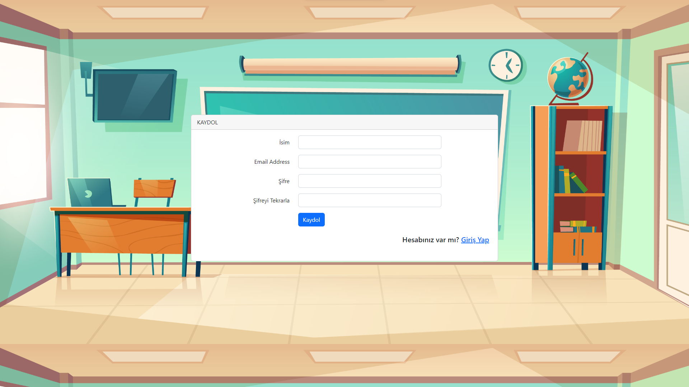

#   Classroom Management
## Kaynaklar
**Framework :** 

<image src="https://laravel.com/img/logomark.min.svg"  width="75">
<image src="https://laravel.com/img/logotype.min.svg"  width="300">

 
 

**Language :**

<image src="https://www.php.net/images/logos/php-logo.svg"  width="300">

## Proje İçeriği
 * Öğretmenlerin giriş ve kayıt olabilecekleri bir platform
 * Öğretmenlerin ders tanımlamaları yapabilecek
 * Sınav başlatablecek 
 * Öğrencilere ders notları paylşabilecek
 * Ders yoklaması alınabilecek

## Proje Amacı 
 * Sınıf konturolünü tamamen online bir şekilde yapaılması
 * Öğretmenlerin öğrencileri daha kolay bir şekilde incelemesi amaçlanmakta
 * Yapılacak olan mobil ve windows uygulamalarına API'lar ile destkelemesi en temel amacı
 * Gereksiz kağıt masrafını önlemek

 # Projeye Genel Bakış

## Login ve Register

* Öğretmenlerin mail adresi ve şifresini girerek giriş yapabilmektedir eğer şifresini unutursa mail adresine şifre yenileme maili gönedrilmektedir.
* Kayıdol ekranı olabildiğince kullanışlı olması açısından basit ve az isteklerde bulunulmuştur.
    

    
    
## Projeye Bağlanacak Mobil Ve Windows Uygulamalarının Kaynakları
**Framework :** 

<image src="https://storage.googleapis.com/cms-storage-bucket/ec64036b4eacc9f3fd73.svg"  width="300">
 
 

**Language :**

<image src="https://dart.dev/assets/img/shared/dart/logo+text/horizontal/white.svg"  width="300">
 
 
